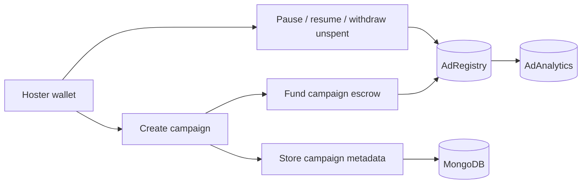
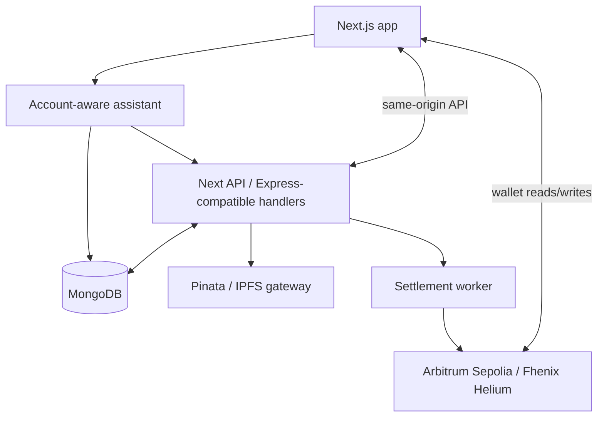

# AdNode - Confidential Ad Settlement Marketplace


AdNode is a hoster-to-developer ad marketplace where campaign economics can stay confidential on-chain with Fhenix CoFHE, while payout and settlement rules remain enforceable in plain wei. A Next.js app, API layer, MongoDB, workers, and Solidity contracts work together so impressions, clicks, approvals, settlements, and claims are auditable end to end.

---

## What Problem This Solves

| Pain | How AdNode handles it |
|------|------------------------|
| Opaque or gameable payouts | Settlement transactions must match on-chain terms and non-replayable settlement accounting. |
| Leaking campaign economics | Budget and CPC use encrypted Fhenix fields where supported, while enforceable settlement pricing remains public. |
| Publisher access control | Campaign-slot access requires admin approval before assignment and serving. |
| Creative hosting | Creatives are stored as URIs, commonly IPFS/Pinata, with server-side upload and metadata checks. |
| Replay and fake measurement | Embed tokens, nonces, duplicate keys, quotas, and settlement replay protection reduce abuse. |

Fhenix / CoFHE context: AdNode uses the Fhenix confidentiality model for private campaign fields and keeps settlement math auditable where contracts must enforce value transfer.

---

## Architecture

### Hoster Flow



### Developer Flow

```mermaid
flowchart LR
  D[Developer wallet] --> S[Register slot]
  S --> DB[(MongoDB)]
  S --> R[(AdRegistry)]
  D --> Q[Request campaign access]
  Q --> ADM[Admin approval]
  ADM --> AS[Assign campaign]
  AS --> EMB[Embed renders ad]
  EMB --> MEA[/api/measure]
  MEA --> SET[Settlement worker]
  SET --> R
  D --> CL[Claim earnings]
```

### Runtime



---

## Repository Layout

| Area | Path | Role |
|------|------|------|
| Frontend app | `frontend/` | Frontend service folder; runs the Next.js app from its own package scripts |
| Backend app | `backend/` | Backend service folder; runs Express API, settlement worker, and smoke test scripts |
| Contracts | `contracts/AdRegistry.sol` | Campaigns, slots, approvals, settlement, escrow, claims |
| Contracts | `contracts/AdAnalytics.sol` | Authorized measurement/settlement counters |
| Contracts | `contracts/AdNodePayoutWrapper.sol` | Payout wrapper path |
| Deploy | `scripts/deploy.cjs` | Deploy contracts and write `deployments/<network>.json` plus ABIs |
| Deploy | `deployments/fhenixArbitrumSepolia.json` | Arbitrum Sepolia deployment config |
| Deploy | `deployments/fhenixHelium.json` | Fhenix Helium deployment config |
| Frontend | `app/`, `components/`, `lib/` | Next.js app, Studio, wallet, embeds, assistant |
| Backend | `server/` | Services, repositories, auth, measurement, settlement, assistant |
| Serverless | `api/[...path].ts` | Vercel API entrypoint sharing server behavior |
| Workers | `scripts/settlement-worker.ts` | Background settlement replay/processing |
| Tests | `tests/` | Server and contract tests |
| Docs | `docs/` | Architecture, acceptance, audit, operations runbooks |

---

## Stack

- Frontend: Next.js 14, TypeScript, RainbowKit, Wagmi, Viem, Framer Motion, Recharts, Zustand
- Backend: Next API routes, Express-compatible services, MongoDB, signed wallet auth
- Chain: Arbitrum Sepolia `421614` by default; Fhenix Helium `8008135` supported with matching deployment config
- Contracts: Hardhat, Solidity, Fhenix CoFHE contracts, on-chain settlement accounting
- AI: Groq-backed assistant with account-aware read-only tools

---

## Account-Aware Assistant

The floating chat works in two modes:

- Public mode works without a connected wallet for general AdNode questions. It does not expose account data and asks the user to connect/sign for private campaign, slot, earnings, or withdrawal questions.
- Signed account mode uses a wallet signature for `assistant:ask` and reads only the connected wallet's campaigns, slots, access approvals, campaign funds, settlement state, measurement summaries, claimable earnings, and next actions.
- The assistant is read-only. It does not execute transactions or spend funds; it points users to the correct Studio actions for writes such as funding, approval, settlement, claim, pause, or withdraw.
- Vague prompts no longer fall back to generic intros like "AdNode is an ad platform"; the assistant asks a concrete follow-up or uses the connected account context.

Relevant endpoints:

- `POST /api/assistant-chat` for public chat
- `POST /api/assistant` for signed wallet chat

---

## Environment

Copy `.env.example` to `.env` and fill real values locally or in Vercel. Never commit secrets.

Required for normal app/runtime:

- `NEXT_PUBLIC_WALLETCONNECT_PROJECT_ID`
- `NEXT_PUBLIC_CHAIN_ID` / `VITE_CHAIN_ID`
- `NEXT_PUBLIC_RPC_URL` or `VITE_FHENIX_RPC_URL`
- `NEXT_PUBLIC_AD_REGISTRY_ADDRESS`, `NEXT_PUBLIC_AD_ANALYTICS_ADDRESS`, `NEXT_PUBLIC_PAYOUT_WRAPPER_ADDRESS`
- `VITE_ADREGISTRY_ADDRESS`, `VITE_ADANALYTICS_ADDRESS`, `VITE_PAYOUT_WRAPPER_ADDRESS`
- `MONGO_URI`
- `ADNODE_EMBED_SECRET`
- `ADNODE_ADMIN_ADDRESSES`
- `ADNODE_SETTLEMENT_OPERATOR_ADDRESSES`

Required for deployment/settlement operations:

- `PRIVATE_KEY`
- `SETTLEMENT_PRIVATE_KEY`
- `WRAPPED_NATIVE_TOKEN_ADDRESS`
- `CRON_SECRET` or `ADNODE_SETTLEMENT_CRON_SECRET`
- `ADNODE_STRICT_MODE=true` for production-like checks

Optional integrations:

- `GROQ_API_KEY`, `GROQ_MODEL` for the assistant
- `PINATA_JWT` or `PINATA_API_KEY` / `PINATA_API_SECRET` for creative uploads
- `NEXT_PUBLIC_ADNODE_NETWORK=fhenixHelium` and `VITE_ADNODE_NETWORK=fhenixHelium` to switch to Helium deployments

---

## Deploy Contracts

Arbitrum Sepolia:

```bash
npm run deploy:contracts -- --network fhenixArbitrumSepolia
```

Fhenix Helium:

```bash
npm run deploy:helium
```

Deployment writes `deployments/<network>.json` and refreshes `lib/abi/*.json`. After deploying, update the public and server contract address env vars so the frontend, API, worker, and scripts all point to the same contracts.

---

## Smoke Test

Run the live marketplace smoke test after contracts, env, MongoDB, and wallet funding are ready:

```bash
npm run smoke:marketplace
```

The smoke test uses the configured testnet and performs a real flow: create/fund campaign, register slot, request and approve access, assign campaign, record measurement, settle once, claim earnings, pause, and withdraw unspent funds. It spends testnet gas and uses the configured private keys.

---

## Settlement Rules

- Campaigns define a settlement pricing model: CPC or CPM.
- CPC settlement credits one payout per unique accepted click.
- CPM settlement credits completed 1000-impression units.
- Duplicate event or epoch settlement is rejected.
- Escrow decrement and developer payout reservation are atomic on-chain.
- Settlement workers submit verified units; they do not choose arbitrary payout amounts.

---

## Product Routes

- `/app` - main Studio with advertiser and publisher workflows
- `/app/account` - wallet account dashboard, campaign/slot summary, claim actions
- `/app/studio/create` - campaign creation flow
- `/app/studio/publisher/slots` - publisher slot management and embed generation
- `/app/studio/publisher/earnings` - publisher earnings and claim history
- `/app/studio/admin` - access approval dashboard for admin wallets
- `/docs` - in-app documentation

Signed auto-sync endpoints keep frontend-created records aligned with MongoDB:

- `POST /api/campaigns-auto`
- `POST /api/slots-auto`

---

## Verification Commands

```bash
npm test
npm run build
npm run smoke:marketplace
```

Use the smoke test only when real testnet env and funded wallets are available.

Local split-service commands:

```bash
cd backend
npm run dev

cd ../frontend
npm run dev
```

---

## Further Reading

- [CoFHE architecture overview](https://cofhe-docs.fhenix.zone/deep-dive/cofhe-components/overview)
- [FHE library quick start](https://cofhe-docs.fhenix.zone/fhe-library/introduction/quick-start)
- [Research in Fhenix](https://cofhe-docs.fhenix.zone/deep-dive/research/research-in-fhenix)
- `docs/ADNODE_ARCHITECTURE.md`
- `docs/PRODUCTION_ACCEPTANCE.md`
- `docs/OPERATIONS_RUNBOOK.md`
- `docs/ADNODE_AUDIT_REPORT.md`

---

## License

See contract SPDX headers and `package.json`. The package is private by default.
