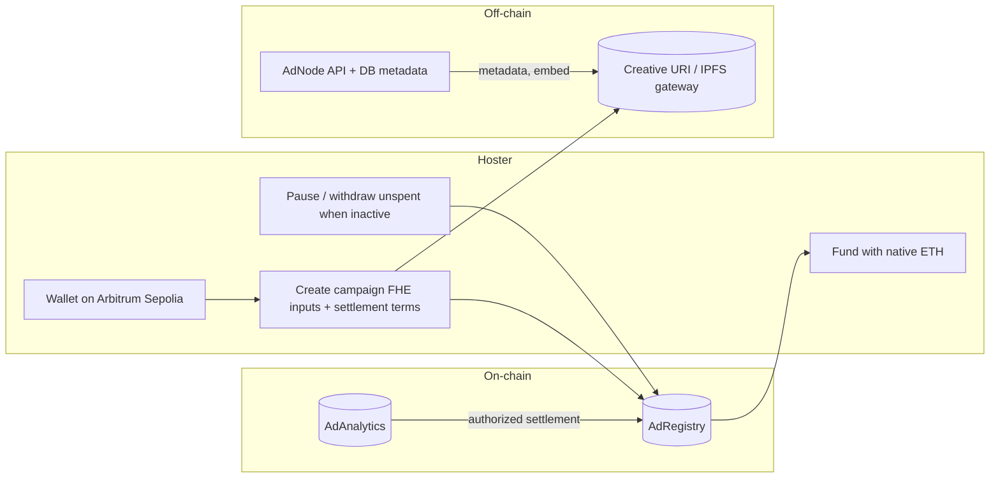
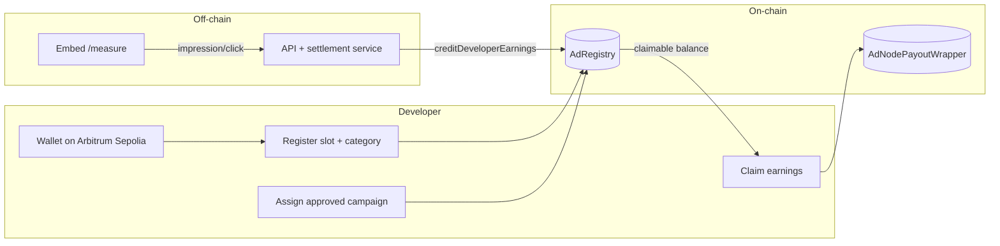
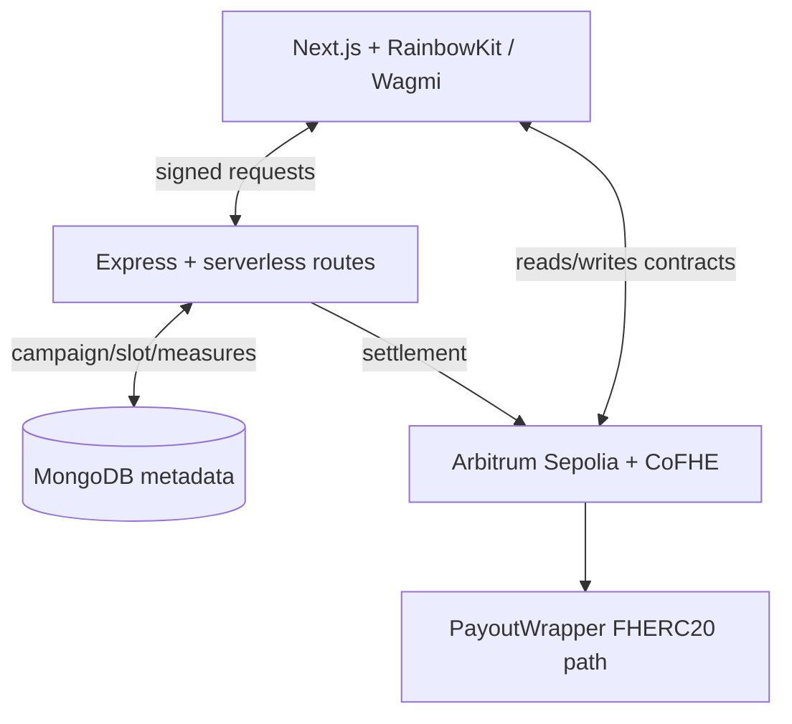

# AdNode — Confidential ad settlement on Fhenix

AdNode is a **hoster ↔ developer** ad stack where **campaign economics can stay confidential on-chain (Fhenix CoFHE)** while **payouts and pricing rules are enforceable in plain wei**. A small Next.js app, API, and three Solidity contracts work together so embed impressions/clicks can settle without the hoster or developer trusting a central payout server for arbitrary amounts.

---

## What problem this solves

| Pain | How AdNode approaches it |
|------|---------------------------|
| **Opaque or gameable payouts** | Settlement txs must match **on-chain terms** (`getSettlementTerms` + `reserveDeveloperPayout` CPC/CPM checks). |
| **Leaking budget & bids** | Budget and CPC are **`euint64` / `euint32`** encrypted fields using **Fhenix `FHE.sol`** (CoFHE), with hoster-controlled `FHE.allow` visibility. |
| **Creative hosting** | Creatives are referenced by **URI** (commonly `ipfs://…` served via a gateway). The chain does not need to store media bytes. |
| **Sybil / spoofing** | API hardening (signed replay, measurement fingerprinting, rate limits) — **defense in depth**, not a silver bullet. |

**Fhenix / CoFHE (from [Fhenix documentation](https://cofhe-docs.fhenix.zone))** — *Co-processor for Fully Homomorphic Encryption*: smart contracts use **`FHE.sol`** for operations on encrypted types; the broader system includes task routing, ciphertext registry, and **threshold decryption** so plaintext only emerges under defined rules. AdNode uses that model for **confidential campaign fields** while keeping **settlement math auditable** where enforcement requires it.

Research context: Fhenix’s [research overview](https://cofhe-docs.fhenix.zone/deep-dive/research/research-in-fhenix) describes threshold FHE decryption and performance work — your app benefits from that stack when running on a supported Fhenix network with CoFHE enabled.

---


## Architecture — Hoster vs developer

### Hoster flow (campaign owner)



### Developer flow (slot owner)



### End-to-end (product + Fhenix)



---

## Repository layout (main files)

| Area | Path | Role |
|------|------|------|
| **Contracts** | `contracts/AdRegistry.sol` | Campaigns, slots, FHE budget/CPC, settlement enforcement, claims |
| | `contracts/AdAnalytics.sol` | Analytics / settlement manager hooks |
| | `contracts/AdNodePayoutWrapper.sol` | Confidential payout wrapper (FHERC20 native wrapper) |
| **Deploy** | `scripts/deploy.cjs` | Deploy all three; write `deployments/<network>.json` + ABIs |
| | `deployments/fhenixArbitrumSepolia.json` | **Default** app deployment (Arbitrum Sepolia) |
| | `deployments/fhenixHelium.json` | Helium addresses (optional network) |
| | `hardhat.config.cjs` | `fhenixArbitrumSepolia` + `fhenixHelium` networks |
| **Frontend** | `app/` | Next.js App Router: `/` (workflow), `/app` (advertiser + publisher tabs), `/app/account` (wallet). Legacy `/app/host` & `/app/developer` redirect into `/app`. |
| | `components/web3/` | Wagmi, RainbowKit, gates |
| | `components/layout/nav.tsx` | Nav |
| | `lib/wagmi.ts`, `lib/chain.ts`, `lib/contracts.ts` | Chain + contract addresses |
| **Backend** | `server/index.ts` | Express API |
| | `server/settlement-service.ts` | On-chain settlement calls |
| | `server/public-campaigns.ts` | Embed HTML, creative resolution, SSRF guard |
| | `server/measurement.ts`, `server/chain-state.ts` | Measures + viem client |
| **Serverless** | `api/*.ts` | Vercel-style API parity |
| **ABIs** | `lib/abi/*.json` | Shared ABIs for app + server |
| **Docs** | `docs/ADNODE_ARCHITECTURE.md`, `docs/ADNODE_AUDIT_REPORT.md` | Deeper design / notes |
| **Config** | `.env.example`, `next.config.mjs`, `tsconfig.json` | Env + build |

---

## Stack

- **Frontend:** Next.js 14, TypeScript, RainbowKit + Wagmi + Viem, CSS modules, Framer Motion, Recharts (Account charts), Zustand
- **Wallet:** WalletConnect via RainbowKit `projectId`
- **Chain (default):** Arbitrum Sepolia **421614**; optional Fhenix Helium **8008135** via `NEXT_PUBLIC_ADNODE_NETWORK=fhenixHelium` + matching RPC/ABIs
- **Confidentiality:** `@fhenixprotocol/cofhe-contracts` / `FHE.sol`, `@cofhe/sdk` where used
- **Backend:** Express, MongoDB (metadata), signed auth for sensitive routes

---

## Environment

Copy `.env.example` → `.env`. Minimum for the app:

- `NEXT_PUBLIC_WALLETCONNECT_PROJECT_ID`
- `NEXT_PUBLIC_AD_REGISTRY_ADDRESS`, `NEXT_PUBLIC_AD_ANALYTICS_ADDRESS`, `NEXT_PUBLIC_PAYOUT_WRAPPER_ADDRESS`  
  (defaults fall back to `deployments/fhenixArbitrumSepolia.json`)
- `VITE_CHAIN_ID` / `NEXT_PUBLIC_CHAIN_ID` — default **421614**
- `NEXT_PUBLIC_RPC_URL` or `VITE_FHENIX_RPC_URL` — e.g. `https://sepolia-rollup.arbitrum.io/rpc`
- `VITE_ADREGISTRY_ADDRESS`, `VITE_ADANALYTICS_ADDRESS` — **same** registry/analytics for the API server
- `ADNODE_EMBED_SECRET`, optional `ADNODE_STRICT_MODE`, Mongo URI, Pinata keys if you upload creatives via API

---

## Deploy contracts

**Arbitrum Sepolia (default app target)** — Hardhat network `fhenixArbitrumSepolia` in `hardhat.config.cjs`:

1. Set `PRIVATE_KEY`, `WRAPPED_NATIVE_TOKEN_ADDRESS`, and `VITE_FHENIX_RPC_URL` (or `ARBITRUM_SEPOLIA_RPC_URL`) to a working Arbitrum Sepolia RPC.
2. Run:

```bash
npx hardhat run scripts/deploy.cjs --network fhenixArbitrumSepolia
```

This writes **`deployments/fhenixArbitrumSepolia.json`** and refreshes **`lib/abi/*.json`**.

**Fhenix Helium** — use `npm run deploy:helium` (network `fhenixHelium`, writes `deployments/fhenixHelium.json`). Then set `NEXT_PUBLIC_ADNODE_NETWORK=fhenixHelium` and matching env addresses.

---

## Settlement rules (summary)

- `createCampaign` requires **settlement pricing model** (CPC / CPM) and **`settlementRateWei`**.
- `reserveDeveloperPayout` enforces **exact CPC amount** or **CPM multiples** within bounds.
- **`getSettlementTerms`** is used to preflight off-chain settlement before crediting earnings.
- Breaking ABI changes require **redeploy** and new campaigns.

---

## Product routes

- **`/app/account`** — Hoster campaigns + developer slots, Recharts snapshots, **`claimMyEarnings`**
- **`/app/portfolio`** — redirects to **`/app/account`**
- **`/docs`** — In-app documentation

---

## Further reading

- [CoFHE architecture overview](https://cofhe-docs.fhenix.zone/deep-dive/cofhe-components/overview)
- [FHE library quick start](https://cofhe-docs.fhenix.zone/fhe-library/introduction/quick-start)
- [Research in Fhenix](https://cofhe-docs.fhenix.zone/deep-dive/research/research-in-fhenix)

---

## License

See contract SPDX headers and project `package.json` (private by default).
